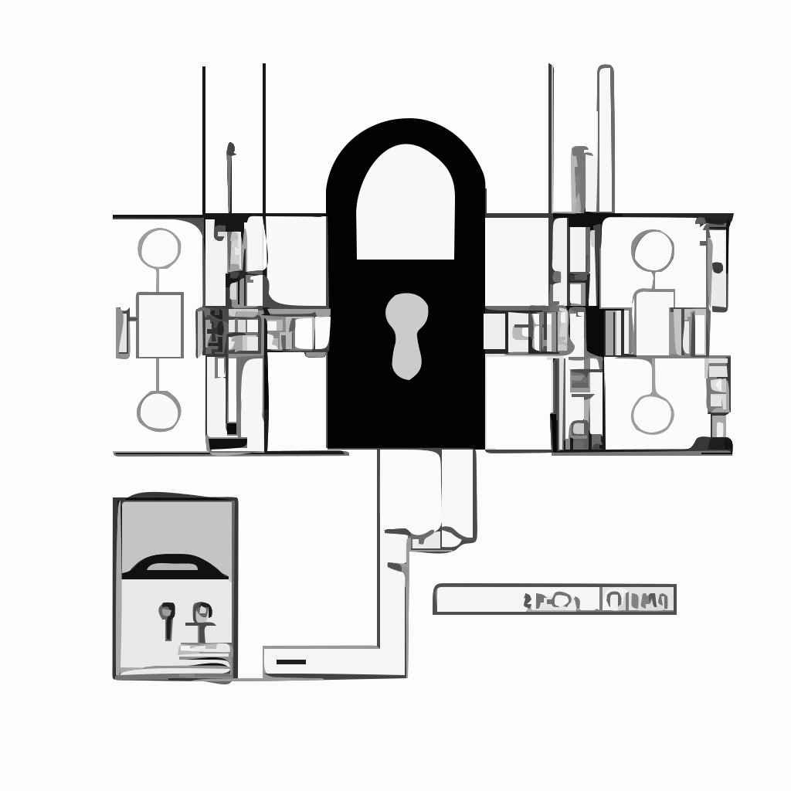

# keycloak-backend

[](https://www.npmjs.com/package/keycloak-backend)
[](https://www.npmjs.com/package/keycloak-backend)
[](https://www.npmjs.com/package/keycloak-backend)
[](https://www.npmjs.com/package/keycloak-backend)
[](https://github.com/BackendStack21/keycloak-backend.git)



Keycloak Node.js minimalist connector for backend services integration. It aims to serve as base for high performance authorization middlewares.

> In order to use this module, the used Keycloak client `Direct Access Grants Enabled` setting should be `ON`

## Keycloak Introduction

The awesome open-source Identity and Access Management solution develop by RedHat.
Keycloak support those very nice features you are looking for:

- Single-Sign On
- LDAP and Active Directory
- Standard Protocols
- Social Login
- Clustering
- Custom Themes
- Centralized Management
- Identity Brokering
- Extensible
- Adapters
- High Performance
- Password Policies

More about Keycloak: http://www.keycloak.org/

### Compatibility

This library is tested against **Keycloak 26.0** (latest as of writing).
It supports modern Keycloak versions by default. For versions older than 18, set `is_legacy_endpoint: true`.

## Using the keycloak-backend module

### Configuration

```js
const Keycloak = require('keycloak-backend').Keycloak
const keycloak = new Keycloak({
  "realm": "realm-name",
  "keycloak_base_url": "https://keycloak.example.org",
  "client_id": "super-secure-client",
  "client_secret": "super-secure-secret", // Optional: for client_credentials grant
  "username": "user@example.org", // Optional: for password grant
  "password": "passw0rd", // Optional: for password grant
  "is_legacy_endpoint": false, // Optional: true for Keycloak < 18
  "timeout": 10000, // Optional: HTTP request timeout in ms (default: 10000)
  "httpsAgent": new https.Agent({ ... }), // Optional: Custom HTTPS agent
  "onError": (err, ctx) => console.error(ctx, err) // Optional: Error handler hook
})
```

> The `is_legacy_endpoint` configuration property should be TRUE for older Keycloak versions (under 18)

For TypeScript:

```ts
import { Keycloak } from "keycloak-backend";
const keycloak = new Keycloak({
  realm: "realm-name",
  keycloak_base_url: "https://keycloak.example.org",
  client_id: "super-secure-client",
  // ... other options
});
```

### Generating access tokens

```js
const accessToken = await keycloak.accessToken.get();
```

Or:

```js
request.get("http://service.example.org/api/endpoint", {
  auth: {
    bearer: await keycloak.accessToken.get(),
  },
});
```

### Validating access tokens

#### Online validation

This method requires online connection to the Keycloak service to validate the access token. It is highly secure since it also check for possible token invalidation. The disadvantage is that a request to the Keycloak service happens on every validation:

```js
const token = await keycloak.jwt.verify(accessToken);
//console.log(token.isExpired())
//console.log(token.hasRealmRole('user'))
//console.log(token.hasApplicationRole('app-client-name', 'some-role'))
```

#### Offline validation

This method perform offline JWT verification against the access token using the Keycloak Realm public key. Performance is higher compared to the online method, as a disadvantage no access token invalidation on Keycloak server is checked:

```js
// Ensure your public key is in PEM format
const cert = `-----BEGIN PUBLIC KEY-----
...your public key...
-----END PUBLIC KEY-----`;
const token = await keycloak.jwt.verifyOffline(accessToken, cert);
//console.log(token.isExpired())
//console.log(token.hasRealmRole('user'))
//console.log(token.hasApplicationRole('app-client-name', 'some-role'))
```

## Testing

The project includes a comprehensive integration test suite that runs against a real Keycloak instance using Docker Compose.

To run the integration tests:

```bash
npm run test:integration
```

This will:

1. Spin up a Keycloak 26 container and a Postgres database.
2. Import a test realm with pre-configured clients and users.
3. Run the test suite to verify token generation, validation (online/offline), and role checks.
4. Tear down the environment.

## Breaking changes

### v4

- Codebase migrated from JavaScript to TypeScript. Many thanks to @neferin12

### v3

- The `UserManager` class was dropped
- The `auth-server-url` config property was changed to `keycloak_base_url`
- Most recent Keycloak API is supported by default, old versions are still supported through the `is_legacy_endpoint` config property
